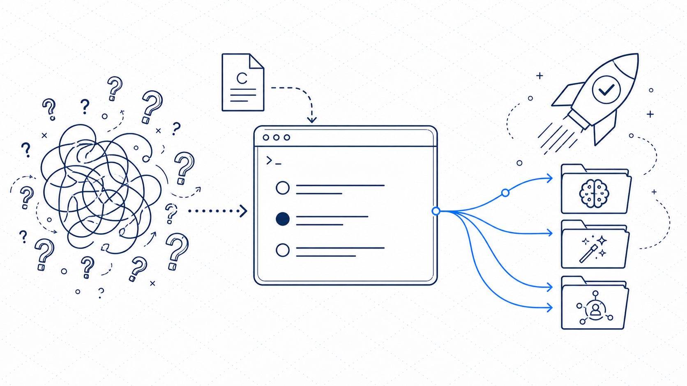

<div align="center">



<br />
<br />

# Claude Code Guide

**The practitioner's guide to Claude Code.**
From "what even is this?" to "I can't work without it."

Conversational. Opinionated. Interactive terminal demos on every page.

[](https://claudecodeguide.dev)
[](LICENSE)
[](https://github.com/mshadmanrahman/claudecode-guide/pulls)
[](https://github.com/mshadmanrahman/claudecode-guide/stargazers)

</div>

---

Most people install Claude Code, type a prompt, get a mediocre answer, and walk away thinking "AI coding tools aren't that useful."

They're wrong. They just skipped the setup.

**Without CLAUDE.md:** Claude Code guesses your stack, writes `.jsx` in a TypeScript project, uses inline styles when you use Tailwind.

**With CLAUDE.md:** Same prompt produces production-ready code that matches your exact conventions. Every time.

This guide shows you how to go from zero to "I can't work without this" in about a week.

## Start Here

**The guide lives at [claudecodeguide.dev](https://claudecodeguide.dev).** You don't need to install anything or clone this repo. Just open the site and start reading.

[**Open the 9-Step Setup Guide**](https://claudecodeguide.dev/guide)  - takes about an hour, sticks forever.

---

## Who This Is For

You don't need to be a developer. You don't need to know what a terminal is. You need to want Claude Code to actually work well.

- **Absolute beginners** who installed Claude Code and aren't sure what to do next
- **Developers** who use it daily but feel like they're leaving half the value on the table
- **Product Managers** who want to ship without waiting for eng  - there's a whole templates section for you
- **Founders** building MVPs with AI and no dedicated engineering team
- **Team Leads** rolling out Claude Code across a team and want a repeatable playbook
- **Anyone** who tried it once, thought "meh", and deserves a second shot with proper context

---

## What's Inside

The guide is 34 pages across 5 sections, plus **15 hands-on tutorials** for every audience. Here's the full table of contents:

<table>
<tr>
<td width="50%">

### Foundations (9 pages)
- [Which Interface?](https://claudecodeguide.dev/docs/foundations/which-interface)  - Terminal vs IDE vs Web vs Desktop
- [The CLAUDE.md Guide](https://claudecodeguide.dev/docs/foundations/claude-md)  - The most important file in your project
- [Session Lifecycle](https://claudecodeguide.dev/docs/foundations/session-lifecycle)  - Stop re-explaining yourself
- [Plan Mode](https://claudecodeguide.dev/docs/foundations/plan-mode)  - Think before you build
- [Permissions](https://claudecodeguide.dev/docs/foundations/permissions)  - Stop clicking "Allow" on everything
- [Prompting](https://claudecodeguide.dev/docs/foundations/prompting)  - It's not what you think
- [Shortcuts](https://claudecodeguide.dev/docs/foundations/shortcuts)  - Commands cheat sheet
- [Cost Optimization](https://claudecodeguide.dev/docs/foundations/cost-optimization)  - Is it worth $200/month?
- [Glossary](https://claudecodeguide.dev/docs/foundations/glossary)  - Every term in plain English

</td>
<td width="50%">

### Patterns (5 pages)
- [Skills](https://claudecodeguide.dev/docs/patterns/skills)  - Turn tasks into commands
- [Hooks](https://claudecodeguide.dev/docs/patterns/hooks)  - Automate quality checks
- [Sub-Agents](https://claudecodeguide.dev/docs/patterns/agents)  - Delegate focused work
- [MCP Servers](https://claudecodeguide.dev/docs/patterns/mcp-servers)  - Connect to Slack, GitHub, Jira
- [Autonomous Loops](https://claudecodeguide.dev/docs/patterns/autonomous-loops)  - Work while you sleep

### Workflows (4 pages)
- [Daily Practice](https://claudecodeguide.dev/docs/workflows/daily-practice)  - The system that compounds
- [Debugging](https://claudecodeguide.dev/docs/workflows/debugging)  - Stop guessing, start investigating
- [Team Adoption](https://claudecodeguide.dev/docs/workflows/team-adoption)  - Roll out to your team
- [CI/CD](https://claudecodeguide.dev/docs/workflows/ci-cd)  - Claude Code in pipelines

</td>
</tr>
<tr>
<td>

### Comparisons (6 pages)
- [vs Cursor](https://claudecodeguide.dev/docs/comparisons/vs-cursor)
- [vs GitHub Copilot](https://claudecodeguide.dev/docs/comparisons/vs-copilot)
- [vs Windsurf](https://claudecodeguide.dev/docs/comparisons/vs-windsurf)
- [vs OpenAI Codex](https://claudecodeguide.dev/docs/comparisons/vs-codex)
- [vs Gemini CLI](https://claudecodeguide.dev/docs/comparisons/vs-gemini-cli)
- [Pro vs Max vs API](https://claudecodeguide.dev/docs/comparisons/pro-vs-max)

</td>
<td>

### Templates (4 pages)
- [Next.js App](https://claudecodeguide.dev/docs/templates/nextjs-app)
- [Monorepo](https://claudecodeguide.dev/docs/templates/monorepo)
- [Python Project](https://claudecodeguide.dev/docs/templates/python-project)
- [PM Workspace](https://claudecodeguide.dev/docs/templates/pm-workspace)

### Interactive
- [9-Step Setup Guide](https://claudecodeguide.dev/guide) with progress tracking
- [Learning Roadmap](https://claudecodeguide.dev/roadmap)
- [Blog](https://claudecodeguide.dev/blog)

### Tutorials (15 hands-on micro-projects)
**Start Here**  - terminal + Claude App + VS Code routes
- [Build Your First CLAUDE.md](https://claudecodeguide.dev/tutorials/your-first-claude-md)
- [Ship a Landing Page in 30 Minutes](https://claudecodeguide.dev/tutorials/ship-a-landing-page)
- [Create Your First Skill](https://claudecodeguide.dev/tutorials/your-first-skill)

**No Terminal Required**  - Claude web app only
- [Build a Stakeholder Map](https://claudecodeguide.dev/tutorials/stakeholder-map)
- [Automate Your Newsletter](https://claudecodeguide.dev/tutorials/newsletter-automator)

**For Product Managers**
- [Product Discovery with OSTs](https://claudecodeguide.dev/tutorials/product-discovery-ost)
- [Meeting Notes → Jira Tickets](https://claudecodeguide.dev/tutorials/meeting-to-jira)
- [Weekly Status Report Generator](https://claudecodeguide.dev/tutorials/weekly-status)
- [Competitive Analysis in 30 Minutes](https://claudecodeguide.dev/tutorials/competitive-analysis)
- [Decision Memo from a Brain Dump](https://claudecodeguide.dev/tutorials/decision-memo)

**For Everyone**  - no code, no terminal
- [Performance Review in 20 Minutes](https://claudecodeguide.dev/tutorials/performance-review)
- [5 Articles → Research Briefing](https://claudecodeguide.dev/tutorials/research-briefing)
- [Slide Deck Outline in 15 Minutes](https://claudecodeguide.dev/tutorials/slide-deck-outline)
- [Job Application Assistant](https://claudecodeguide.dev/tutorials/job-application-assistant)
- [Personal Finance Manager](https://claudecodeguide.dev/tutorials/personal-finance-manager)

</td>
</tr>
</table>

---

## Every Page Has Interactive Terminal Demos

No walls of text. Every concept shows you what to expect before you try it:

```
~ $ claude "add email validation to the signup flow"
  Reading signup form, API route, and schema...
  ✓ Created lib/validation.ts
  ✓ Updated signup form with error states
  ✓ Added server-side validation in API route
  ✓ 3 tests written and passing
  → Same task. Autocomplete vs full execution.
```

45+ animated terminal demos across 34 pages. Every tutorial also has an animated Claude App chat demo  - no terminal required. The philosophy: **show, don't tell.**

---

## PM Toolkit Family

Once you've finished the guide, there are a few other tools built for the same audience  - practitioners who want to actually get things done with AI, not just read about it.

If you're a PM specifically, [PM Pilot](https://github.com/mshadmanrahman/pm-pilot) is built for you  - Claude Code pre-configured for product work, ready to install once you've done the guide.

| Tool | What it does |
|------|-------------|
| [pm-pilot](https://github.com/mshadmanrahman/pm-pilot) | Claude Code configured for PMs. 25 skills, ready to install. |
| [bug-shepherd](https://github.com/mshadmanrahman/bug-shepherd) | Zero-code bug triage for PMs. |
| [ceremonies](https://github.com/mshadmanrahman/ceremonies) | Agile ceremonies that don't suck. Retros, estimation, team analytics  - open source. |
| [morning-digest](https://github.com/mshadmanrahman/morning-digest) | Your morning briefed in 30 seconds. |
| [root-kg](https://github.com/mshadmanrahman/root-kg) | Your knowledge graph. Ask questions across all your notes, meetings, and emails  - cited answers in plain English. |

---

## Contributing

The guide is built with Next.js and Fumadocs. Every article is an `.mdx` file in `content/docs/`. If you can write Markdown, you can contribute.

**Ways to help:**

- **Fix a typo**  - edit any `.mdx` file and open a PR
- **Suggest a topic**  - open an issue
- **Add a template**  - create a new `.mdx` in `content/docs/templates/`
- **Improve a demo**  - DemoCard components are in `src/components/demo-card.tsx`

**To run the site locally:**

```bash
git clone https://github.com/mshadmanrahman/claudecode-guide.git
cd claudecode-guide
npm install
npm run dev
```

See [CONTRIBUTING.md](CONTRIBUTING.md) for full details.

**Tech stack:**

| Layer | Tech |
|-------|------|
| Framework | [Next.js 16](https://nextjs.org) (App Router, Turbopack) |
| Docs Engine | [Fumadocs](https://fumadocs.vercel.app) |
| Content | MDX with custom components |
| Styling | Tailwind CSS v4 |
| Fonts | Newsreader + Space Grotesk + Geist Mono |
| Hosting | [Vercel](https://vercel.com) |

## Roadmap

- [x] 34+ content pages with interactive terminal demos
- [x] 9-step interactive setup guide with progress tracking
- [x] Blog with Substack email capture
- [x] Learning roadmap with 5 stages
- [x] Dark mode, responsive, Vercel deployment
- [x] 15 hands-on tutorials  - terminal, Claude App, and VS Code/Cursor routes
- [x] Animated AppChatDemo component for non-coder learning paths
- [x] Shareable achievement cards at the end of every tutorial
- [x] GA4 event tracking (tutorial_start, tutorial_complete)
- [ ] Video walkthroughs (Remotion)
- [ ] Community templates gallery
- [ ] "Ask the guide" AI assistant
- [ ] Translations (Bengali, Swedish, Spanish)

---

## Support

If this guide helped you, give it a star -- it helps others find it and keeps development going.

[](https://github.com/mshadmanrahman/claudecode-guide/stargazers)

[](https://star-history.com/#mshadmanrahman/claudecode-guide&Date)

---

## See Also

- **[pm-pilot](https://github.com/mshadmanrahman/pm-pilot)** -- Claude Code configured for PMs. 25 skills out of the box.
- **[root-kg](https://github.com/mshadmanrahman/root-kg)** -- Personal knowledge graph. Ask questions across all your notes, meetings, and emails.
- **[morning-digest](https://github.com/mshadmanrahman/morning-digest)** -- Your morning briefed in 30 seconds. Calendar, email, Slack, and action items.
- **[discovery-md](https://github.com/mshadmanrahman/discovery-md)** -- AI product discovery for PMs. From braindump to stakeholder one-pager.
- **[ceremonies](https://github.com/mshadmanrahman/ceremonies)** -- Agile ceremonies that don't suck. Retros, estimation, team memory.
- **[bug-shepherd](https://github.com/mshadmanrahman/bug-shepherd)** -- Zero-code bug triage for PMs. Reproduce and sync bugs without reading code.

---

## License

MIT. Use it, fork it, make it yours.

---

<div align="center">

**Built by [Shadman Rahman](https://shadmanrahman.substack.com)**
Senior Product Manager. Claude Code practitioner. Writing about AI workflows.

[Subscribe to the newsletter](https://shadmanrahman.substack.com) for new guides and updates.

[Share on LinkedIn](https://www.linkedin.com/shareArticle?mini=true&url=https://claudecodeguide.dev&title=Claude%20Code%20Guide) &bull; [Share on X](https://twitter.com/intent/tweet?text=The%20practitioner%27s%20guide%20to%20Claude%20Code.%20Interactive%20terminal%20demos%20on%20every%20page.%20%F0%9F%94%A5&url=https://claudecodeguide.dev)

</div>
